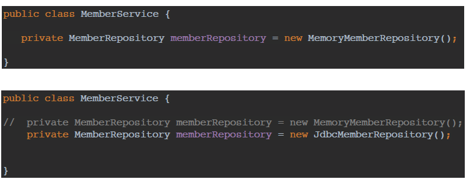

# Spring 공부

## 객체 지향 설계와 스프링

- 이야기 - 자바 진영의 추운 겨울과 스프링의 탄생
    
    이전에 별로였던 EJB를 보완하고 추운 겨울을 지나 좋은 프레임워크를 만들었다고 해서 스프링이구나
    
- 스프링이란?
    
    스프링 프레임워크, 스프링 부트가 핵심
    
    - 왜 만들었나?
        - 자바 언어 기반의 프레임 워크
        - 객체 지향 언어가 가진 강력한 특징을 살려내는 프레임워크
        - 좋은 객체 지향 애플리케이션을 개발할 수 있게 도와준다
        
    
    단순한 기술에 초점을 맞추기 보다 왜 만들었는지가 중요하네
    
    객체 지향 언어가 가진 강력한 특징을 살리는 프레임워크가 스프링이다
    
- 좋은 객체 지향 프로그래밍이란?
    - 유연하고 변경이 용이하다
    - 다형성 : 역할과 구현으로 세상을 구분
        - 자동차가 k3,아반떼, 테슬라로 바뀌어도 자동차의 역할만 바뀌는것
        - 운전자가 자동차를 운전하는 역할은 바뀌지 않음
        - 자동차를 무한으로 구현 가능하다
        
    
    역할과 구현으로 세상을 구분하면 세상이 단순해지고 유연해지며 변경도 편리해진다
    
    - 클라이언트는 대상의 역할(인터페이스)만 알면된다
    - 클라이언트는 구현 대상의 내부 구조를 몰라도 된다
    - 클라이언트는 구현 대상의 내부 구조가 변경되어도 영향을 받지 않는다
    - 클라이언트는 구현 대상 자체를 변경해도 영향을 받지 않는다
    
    역할 = 인터페이스
    
    구현 = 인터페이스를 구현할 클래스 ,구현 객체
    
    혼자 있는 객체는 없고, 클라이언트의 요청과 서버의 응답으로 협력관계를 가진다
    
    역할과 구현을 분리하여 클라이언트를 변경하지 않고, 서버의 구현기능을 유연하게 변경할 수 있다.
    
    스프링에서는 
    
    - 다형성이 가장 중요하다
    - 다형성을 극대화해서 이용할 수 있게 도와준다
    - 제어의 역전(ioc), 의존관계 주입(DI)는 다형성을 활용해서 역할과 구현을 편리하게 다룰 수 있게 지원한다
    - 레고 블럭을 조립하듯이, 공연 무대의 배우를 선택하듯이 구현을 편리하게 변경할 수 있다.
    
    SOLID 개념도 같이 알아야한다
    
    **스프링에선 다형성의 개념을 적용시키는데 중요하구나**
    
- 좋은 객체 지향 설계의 5가지 원칙(SOLID)
    
    SRP : 단일 책임 원칙(Single Responsibility Principle)
    
    - 한 클래스는 하나의 책임만 가져야 한다
    - 변경이 있을때 파급 효과가 적어야한다
    - 하나의 클래스에 여러가지가 들어가있으면 안좋다, 깨진것이다
        - UI 변경, 객체의 생성과 사용을 분리한다
    
    OCP : 개방-폐쇄 원칙 (Open/ Closed Principle)
    
    - 확장에는 열려있으나 변경에는 닫혀 있어야 한다
    
    
    
    MemberService 클라이언트가 구현 클래스를 직접 선택해서 다형성을 적용시켜야 하는데 이러면 클라이언트 코드를 변경이 되기 떄문에 SOLID 중 OCP가 깨진다. 이것도 하면 안된다
    
    - 객체를 생성하고, 연관관계를 맺어주는 별도의 조립, 설정자가 필요하다
    - Spring의 DI등을 활용한다
    
    LSP : 리스코프 치환 원칙(Liskov Substitution Principle)
    
    - 프로그램 객체는 프로그램의 정확성을 깨뜨리지 않으면서 하위 타입의 인스턴스로 바꿀수 있어야한다
    - 다형성에서 하위 클래스는 인터페이스 규약을 다 지켜야하고 인터페이스 구현한 구현체가 믿고 사용하려면 이 원칙이 필요하다
    - 컴파일에 성공하는 것을 넘어서는 이야기
        - 자동차 엑셀은 앞으로 가야하는데 뒤로 가도록 구현하면 LSP를 위반하게 된다.
        
    
    ISP : 인터페이스 분리 원칙 (Interface Segregation Principle)
    
    - 특정 클라이언트를 위한 인터페이스 여러개가 범용 인터페이스 하나보다 낫다
    - 자동차 인터페이스 구현할때 운전 인터페이스, 정비 인터페이스 이 두개로 구현하는게 자동차 하나만 구현하는 것보다 훨씬 낫다
    - 분리하면 정비 인터페이스 자체가 변해도 운전자 클라이언트에 영향을 주지 않기 때문에 인터페이스가 명확해지고 대체가능성이 높아진다
        - 인터페이스를 기능단위로 작게 분리하자.
            - 인터페이스가 명확해지고 대체가능성이 높아진다
            
    
    DIP : 의존관계 역전 원칙 (Dependency Inversion Principle)
    
    - 프로그래머는 추상화에 의존해야지, 구체화에 의존하면 안된다.
    - 구현 클래스에 의존하지 말고 인터페이스에 의존하라는 뜻
    - 역할에 의존해야 한다,
    
    
    
    이건 MemberRepository 클라이언트가 구현 클래스를 의존한다, 코드를 알고 있다는 뜻이다. 
    
    DIP 위반하게 된다
    
    다형성 만으로는 DIP를 지킬수가 없네?
    
    객체 지향의 핵심은 다형성인데 
    
    - 다형성 만으로는 쉽게 부품을 갈아끼우듯이 개발할 수 없다
    - 다형성 만으로는 구현 객체를 변경할 때 클라이언트 코드도 함께 변경된다
    - 다형성 만으로는 OCP, DIP를 지킬 수 없다
    - 뭔가 더 필요하다
        - 스프링을 사용하는 이유
        
    
    다형성이 객체지향에서 제일 중요한데, 다형성 만으로는 SOLID 법칙중에 OCP, DIP를 지킬 수 없다.
    
    변경할때 클라이언트에서 코드를 변경해야하고,
    
    구현 클래스를 의존할 수 밖에없다
    
    그래서 Spring을 사용한다
    
- 객체 지향 설계와 스프링
    
    스프링은 다형성 + OCP, DIP를 가능하게 지원한다
    
    - DI : 의존관계 , 의존성 주입
    - DI 컨테이너 제공
    
    모든 설계에 역할과 구현을 분리하자
    

- 정리
    
    객체 지향의 SOLID 법칙중 OCP와 DIP는 다형성만으로 구현하기 힘든데 Spring은 이것을 가능케하는 프레임 워크이다.
    

---

## 스프링 핵심 원리 이해- 예제 만들기

- 프로젝트 설계 과정
    
    java로도 인터페이스 바로바로 구현하는게 체화가 안되어있어서 한번 정리
    
    
    
    글로 작성된 것을 모두가 알아볼 수 있게 도메인 협력관계를 그린다
    
    
    
    개발자를 위한 클래스 다이어그램을 만든다
    
    
    
    실제 객체가 사용되는 과정을 그린다
    
    1. 등급이 나누어져있으니 grade enum을 생성
    
    ```java
    public enum Grade {
    BASIC,
    VIP
    }
    ```
    
    1. Member 클래스를 만든다 (회원 엔티티)
    
    ```java
    public class Member {
    private Long id;
    private String name;
    private Grade grade;
    public Member(Long id, String name, Grade grade) {
    this.id = id;
    this.name = name;
    this.grade = grade;
    }
    public Long getId() {
    return id;
    }
    public void setId(Long id) {
    this.id = id;
    }
    public String getName() {
    return name;
    }
    public void setName(String name) {
    this.name = name;
    }
    public Grade getGrade() {
    return grade;
    }
    public void setGrade(Grade grade) {
    this.grade = grade;
    }
    }
    ```
    
    - alt + insert로 생성자와 getter setter 생성
    
    
    
    그림을 본 후에 인터페이스를 생성한다
    
    1. 가장 디테일한 MemberRepository 인터페이스 부터 생성 
    
    ```java
    public interface MemberRepository {
    void save(Member member);
    Member findById(Long memberId);
    }
    ```
    
    - 회원 정보를 저장
    - 아이디로 회원을 찾는기능
    
    1. 인터페이스에 대한 세부 구현체를 생성한다
    
    ```java
    public class MemoryMemberRepository implements MemberRepository {
    private static Map<Long, Member> store = new HashMap<>();
    @Override
    public void save(Member member) {
    store.put(member.getId(), member);
    }
    @Override
    public Member findById(Long memberId) {
    return store.get(memberId);
    }
    }
    ```
    
    - store hashmap에 저장한 후에 save, findById구현
    
    1. MemberService 인터페이스 구현 
    
    ```java
    public interface MemberService {
    void join(Member member);
    Member findMember(Long memberId);
    }
    ```
    
    1. MemberSerivce 구현체 구현
    
     
    
    ```java
    public class MemberServiceImpl implements MemberService {
    private final MemberRepository memberRepository = new
    MemoryMemberRepository();
    
    public void join(Member member) {
    memberRepository.save(member);
    }
    public Member findMember(Long memberId) {
    return memberRepository.findById(memberId);
    }
    }
    ```
    
    MemberRepository memberRepository = new MemoryMemberRepository();
    
    - 인터페이스 a = new 인터페이스구현체
    - 근데 이렇게 하면 MemberServiceImpl가 인터페이스 뿐만아니라 구현체도 참조하게 된다 :
        - DIP 문제
    - 다른 저장소로 변경을 할때 MemoryMemberRepository를 변경해야하는데, 이떄 OCP 원칙을 위배하게 된다.
    
    1. 회원가입 main
    
    ```java
    public class MemberApp {
    public static void main(String[] args) {
    MemberService memberService = new MemberServiceImpl();
    Member member = new Member(1L, "memberA", Grade.VIP);
    memberService.join(member);
    Member findMember = memberService.findMember(1L);
    System.out.println("new member = " + member.getName());
    System.out.println("find Member = " + findMember.getName());
    }
    }
    ```
    
    MemberService memberSerivce = new memberServiceImpl()
    
    - 인터페이스 a = new 인터페이스구현체();
    
    이렇게하면 좋은 코드가 아니다, 테스트를 별도로 구현
    
    1. test코드 구현
    
    ```java
    class MemberServiceTest {
    MemberService memberService = new MemberServiceImpl();
    @Test
    void join() {
    //given
    Member member = new Member(1L, "memberA", Grade.VIP);
    //when
    memberService.join(member);
    Member findMember = memberService.findMember(1L);
    //then
    Assertions.assertThat(member).isEqualTo(findMember);
    }
    }
    ```
    
    Order 
    
    
    
      전체적인 다이어그램 구상, 역할과 구현 나누어서
    
    
    
    개발자를 위한 클래스 다이어그램
    
    
    
    
    
    이렇게 역할과 구현을 나누게 되면 변동사항에 맞춰 쉽게 변환할 수 있다
    
    1. 디테일한  Discount policy 인터페이스
    
    ```java
    
    public interface DiscountPolicy {
    /**
    * @return 할인 대상 금액
    */
    int discount(Member member, int price);
    }
    ```
    
    1. Discount policy 인터페이스 구현체 FixDiscountPolicy
    
    ```java
    public class FixDiscountPolicy implements DiscountPolicy {
    private int discountFixAmount = 1000; //1000원 할인
    @Override
    public int discount(Member member, int price) {
    if (member.getGrade() == Grade.VIP) {
    return discountFixAmount;
    } else {
    return 0;
    }
    }
    ```
    
    1. Order 엔티티
    
    ```java
    public class Order {
    private Long memberId;
    private String itemName;
    private int itemPrice;
    private int discountPrice;
    public Order(Long memberId, String itemName, int itemPrice, int
    discountPrice) {
    this.memberId = memberId;
    this.itemName = itemName;
    this.itemPrice = itemPrice;
    this.discountPrice = discountPrice;
    }
    public int calculatePrice() {
    return itemPrice - discountPrice;
    }
    public Long getMemberId() {
    return memberId;
    }
    public String getItemName() {
    return itemName;
    }
    public int getItemPrice() {
    return itemPrice;
    }
    public int getDiscountPrice() {
    return discountPrice;
    }
    @Override
    public String toString() {
    return "Order{" +
    "memberId=" + memberId +
    ", itemName='" + itemName + '\'' +
    ", itemPrice=" + itemPrice +
    ", discountPrice=" + discountPrice +
    '}';
    }
    }
    ```
    
    1. OrderService 인터페이스
    
    ```java
    public interface OrderService {
    Order createOrder(Long memberId, String itemName, int itemPrice);
    }
    ```
    
    1. OrderService 인터페이스 구현체 OrderServiceImpl
    
    ```java
    public class OrderServiceImpl implements OrderService {
    private final MemberRepository memberRepository = new
    MemoryMemberRepository();
    private final DiscountPolicy discountPolicy = new FixDiscountPolicy();
    @Override
    public Order createOrder(Long memberId, String itemName, int itemPrice) {
    Member member = memberRepository.findById(memberId);
    int discountPrice = discountPolicy.discount(member, itemPrice);
    return new Order(memberId, itemName, itemPrice, discountPrice);
    }
    }
    ```
    
    - member을 memberRepository에서 findById로 찾고
    - discountPolicy에서 찾은 member를 넣은 후에 할인정책 적용
    - Order 반환
    
    1. OrderApp main 구현
    
    ```java
    public class OrderApp {
    public static void main(String[] args) {
    MemberService memberService = new MemberServiceImpl();
    OrderService orderService = new OrderServiceImpl();
    long memberId = 1L;
    Member member = new Member(memberId, "memberA", Grade.VIP);
    memberService.join(member);
    Order order = orderService.createOrder(memberId, "itemA", 10000);
    System.out.println("order = " + order);
    }
    ```
    
    - orderService.createOrder로 order 반환
    
    1. Test 코드
    
    ```java
    class OrderServiceTest {
    MemberService memberService = new MemberServiceImpl();
    OrderService orderService = new OrderServiceImpl();
    @Test
    void createOrder() {
    long memberId = 1L;
    Member member = new Member(memberId, "memberA", Grade.VIP);
    memberService.join(member);
    Order order = orderService.createOrder(memberId, "itemA", 10000);
    Assertions.assertThat(order.getDiscountPrice()).isEqualTo(1000);
    }
    }
    ```
    
- 개발 사항의 변경, OCP, DIP 위반 문제
    - 할인정책을 변경하려고한다
    
    DiscountPolicy 인터페이스에 새로운 구현체를 만들어서 넣는다
    
    
    
    변경할때 OrderServiceImpl에서 변경을 해야함
    
    
    
    이떄
    
    
    
    기존 의존관계는 interface만 의존하는게 아닌, 구현체 실제 코드도 의존하게 된다
    
    DIP 위반
    
    
    
    변경에 닫혀있어야 하는 OCP 위반
    
    클라이언트 코드에 영향을 준다 
    
    어떻게 문제를 해결할까?
    
- DIP (의존관계 문제)의 해결 : 관심사의 분리
    - DIP 위반 → 인터페이스에만 의존하도록 해야한다
    
    
    
    ```java
    // private final DiscountPolicy discountPolicy = new FixDiscountPolicy();
       private  DiscountPolicy discountPolicy;
    ```
    
    이렇게 하면 DIP는 지켜지는데 당연히 코드를 모르니 nullpointerException이 발생하겠지
    
    어떻게 할까?
    
    지금까지 발생한 문제는 디카프리오가 직접 여배우를 선택하는 것과 같다
    
    공연 기획자가 원래 해야한다
    
    공연도 해야하고 동시에 여자 주인공도 공연에 직접 초빙해야 하는 다양한 책임을 가진다
    
    - 관심사의 분리
        - 공연 기획자를 만들고 배우가 공연 기획자의 책임을 확실히 분리하자
        
        의존관계 DI 개념
        
        - 자원을 직접 명시하지 말고 의존 객체 주입을 사용하라 (DI)
            - 정리 30p
                
                많은 클래스가 하나 이상의 자원에 의존할때, dictionary는 하나인데 이를 다양한 클래스에서 사용할때 static으로 자원을 사용하거나, 싱글턴으로 구현하는 경우는 안좋다
                
                사전을 예로 들어서 , 사전 하나로 이 모든 쓰임에 대응하는것은 불가능하다.
                
                사용하는 자원에 따라 동작이 달라지는 클래스에는 static 클래스나 싱글턴 방식은 적합하지않다
                
                → 인스턴스를 생성할때 생성자에 **필요한 자원**을 넘겨준다 
                
                : 의존 객체 주입( Dependency Injection)
                
                ```java
                public class Main {
                
                  public static void main(String[] args) {
                    Controller controller = new Controller();
                    controller.print();
                  }
                }
                
                class Controller {
                
                  private Service service;
                
                  public Controller() {
                    this.service = new Service();
                  }
                
                  public void print() {
                    System.out.println(service.message());
                  }
                }
                
                class Service {
                
                  public String message() {
                    return "Hello World!";
                  }
                }
                출처: https://7942yongdae.tistory.com/177 [프로그래머 YD:티스토리]
                ```
                
                이러한 방식은 Controller와 Service와 직접적인 강한 관계가 있고 이는 프로그램의 유연성을 떨어트린다.
                
                controller와 service와의 관계를 직접적이 아닌 간접적인 관계로 만든다→ 의존객체 주입
                
                ```java
                public class Main {
                
                  public static void main(String[] args) {
                    Controller controller = new **Controller(new MessageService());**
                    controller.print();
                  }
                }
                
                interface IService {
                
                  String message();
                }
                
                class Controller {
                
                  private IService service;
                
                 ** public Controller(IService service) {
                    this.service = service;
                  }**
                
                  public void print() {
                    System.out.println(service.message());
                  }
                }
                
                class MessageService implements IService {
                
                  public String message() {
                    return "Hello World!";
                  }
                }
                출처: https://7942yongdae.tistory.com/177 [프로그래머 YD:티스토리]
                ```
                
                이번에는 controller가 service 객체를 생성하지 않고 그저 interface인 Iservice 객체를 사용했다
                
                controller 객체는 messageservice 객체를 몰라도 iservice 객체를 이용하여 출력한다 
                
                →"객체(MessageService)는 내가(Main) 만들게 넌 사용(IService) 해"
                
                **main에 messageserivce 주입** 
                
                [https://7942yongdae.tistory.com/177](https://7942yongdae.tistory.com/177)
                
            
            **직접적인 관계를 갖던 클래스를 간접적인 관계를 갖게해주고**
            
            **필요한 자원을 생성자에 넘겨주는 의존객체 주입을 이용하자.**
            
            **유연성, 재사용성, 테스트 용이성 개선한다.**
            
            자바에서는 이렇게 활용이 됐는데 SOLID 법칙의 DIP를 지키기 위해선 DI가 필수적이다
            
        
        > Effective Java
        > 
        
    
    AppConfig
    
    - 구현객체를 생성하고 연결을 책임진다
    
    ```java
    package hello.core.member;
    
    public class MemberServiceImpl implements MemberService {
        private final MemberRepository memberRepository;
    
        public MemberServiceImpl(MemberRepository memberRepository) {
            this.memberRepository = memberRepository;
        }
    
        public void join(Member member) {
            memberRepository.save(member);
        }
        public Member findMember(Long memberId) {
            return memberRepository.findById(memberId);
        }
    }
    ```
    
    ```java
    public class AppConfig {
    
        public MemberService memberService() {
            return new MemberServiceImpl(new MemoryMemberRepository());
        }
    }
    ```
    
    AppConfig 클래스 
    
    팩토리 메소드를 통하여 MemberServiceImpl에 MemoryMemberRepository를 주입시킨다
    
    ```java
    package hello.core.member;
    
    public class MemberServiceImpl implements MemberService {
        private final MemberRepository memberRepository = new
                MemoryMemberRepository();
        public void join(Member member) {
            memberRepository.save(member);
        }
        public Member findMember(Long memberId) {
            return memberRepository.findById(memberId);
        }
    }
    --------
    기존 코드
        private final MemberRepository memberRepository = new
                MemoryMemberRepository();
    이렇게 MemoryMemberRepository()의 코드를 알게 되며 의존성이있는데
    
    private final MemberRepository memberRepository;
    로 의존성을 인터페이스에만 할당해주고
    //설계 변경으로 MemberServiceImpl 은 MemoryMemberRepository 를 의존하지 않는다!
    
        public MemberServiceImpl(MemberRepository memberRepository) {
            this.memberRepository = memberRepository;
        }
    
    생성자를 생성하여 
    //MemberServiceImpl 입장에서 생성자를 통해 어떤 구현 객체가 들어올지(주입될지)는 알 수 없다.
    외부 appconfig에서 memberRepository 를 MemoryMemberRepository로 주입
    
    ```
    
    - private final MemberRepository memberRepository = new
                MemoryMemberRepository();
    
    를
    
    private final MemberRepository memberRepository;
    
     public MemberServiceImpl(MemberRepository memberRepository) {
            this.memberRepository = memberRepository;
        }
    
    생성자 만들기
    
    ```java
    package hello.core.member;
    
    public class MemberServiceImpl implements MemberService {
        private final MemberRepository memberRepository;
    
        public MemberServiceImpl(MemberRepository memberRepository) {
            this.memberRepository = memberRepository;
        }
    
        public void join(Member member) {
            memberRepository.save(member);
        }
        public Member findMember(Long memberId) {
            return memberRepository.findById(memberId);
        }
    }
    ```
    
    ---
    
    ```java
    public class AppConfig {
    public MemberService memberService() {
    return new MemberServiceImpl(new MemoryMemberRepository());
    }
    public OrderService orderService() {
    return new OrderServiceImpl(
    new MemoryMemberRepository(),
    new FixDiscountPolicy());
    }
    }
    ```
    
    
    
    ```java
    public class MemberServiceImpl implements MemberService {
    private final MemberRepository memberRepository;
    public MemberServiceImpl(MemberRepository memberRepository) {
    this.memberRepository = memberRepository;
    }
    public void join(Member member) {
    memberRepository.save(member);
    }
    public Member findMember(Long memberId) {
    return memberRepository.findById(memberId);
    }
    }
    ```
    
    
    
    
    
    AppConfig로 의존관계를 주입한다 (Dependency Injection)
    
    ```java
    public class OrderApp {
    
        public static void main(String[] args) {
    
            AppConfig appConfig = new AppConfig();
            MemberService memberService = appConfig.memberService();
            OrderService orderService= appConfig.orderService()
           // MemberService memberService = new MemberServiceImpl(null);
           // OrderService orderService = new OrderServiceImpl(null,null);
    
            Long memberId = 1L;
            Member member = new Member(memberId, "memberA", Grade.VIP);
            memberService.join(member);
    
            Order order = orderService.createOrder(memberId, "itemA", 10000);
    
            System.out.println("order = " + order);
        }
    }
    ```
    
    
    
- AppConfig 리팩터링
    
    역할이 한눈에 보이는 게 중요하다. 이렇게 봐꿔보자
    
    ```java
    package hello.core;
    
    import hello.core.discount.DiscountPolicy;
    import hello.core.discount.FixDiscountPolicy;
    import hello.core.member.MemberService;
    import hello.core.member.MemberServiceImpl;
    import hello.core.member.MemoryMemberRepository;
    import hello.core.order.OrderService;
    import hello.core.order.OrderServiceImpl;
    
    public class AppConfig {
    
        public MemberService memberService() {
            return new MemberServiceImpl(memberRepository());
        }
    
        private MemoryMemberRepository memberRepository() {
            return new MemoryMemberRepository();
        }
    
        public OrderService orderService(){
            return new OrderServiceImpl(new MemoryMemberRepository(),new FixDiscountPolicy());
        }
    
        public DiscountPolicy discountPolicy(){
            return new FixDiscountPolicy();
        }
    }
    ```
    
    이렇게 구현하면 이것만 보고 설계에 대한 전체적인 것을 한눈에 알 수 있다
    
    
    
- 할인 정책 바꾸기 (OCP와 DIP를 만족시키는 AppConfig)
    
    
    
    ```java
    appconfig 에서 
    
    public DiscountPolicy discountPolicy(){
           // return new FixDiscountPolicy();
            return new RateDiscountPolicy();
        }
    ```
    
    
    
    Appconfig만 바꾸면 된다 ~
    
    이제 사용 영역에 있는 것은 전혀 손댈 필요가 없다 
    
    AppConfig를 통하여 클라이언트 코드를 손댈필요가 없으므로
    
    이제 DIP와 OCP 둘다 지켜진다.
    
- SOLID 정리
    
    SRP 단일 책임 원칙
    
    - 하나의 클래스는 하나의 책임만 가져야한다
    
    클라이언트 객체가 다양한 책임을 가지고 있었는데 
    
    - AppConfig 를 생성하여 구현 객체를 생성하고 연결
    - 클라이언트 객체는 실행하는 책임만 가짐
    
    DIP 의존관계 역전 원칙
    
    - 프로그래머는 인터페이스에 의존해야하지 구체화에 의존하면 안된다
    - AppConfig로 DI 개념을 활용하여 해결
    
    OCP
    
    소프트웨어 요소는 확장에는 열려있으나 변경에는 닫혀 있어야 한다
    
    클라이언트 코드를 변경하지 않고 AppConfig의 변경을 통하여 이를 해결
    
- IoC, DI, 컨테이너
    - IOC(Inversion Of Control) 제어의 역전
        
        OrderServiceImpl 등 인터페이스만 실행하고 어떤 구현 객체들이 실행될지 모른다
        
        >AppConfig가 제어의 흐름을 가져간다
        
        프로그램을 직접 제어 하는것이 아닌 외부에서 관리하는 것을 제어의 역전IOC라고 부른다
        
        프레임워크
        
        - 내가 작성한 코드를 제어하고 대신 실행 (JUnit)
        - 프레임워크의 생태계 안에서 내 코드가 실행
        
        라이브러리
        
        - 내가 작성한 코드가 직접 제어의 흐름을 담당(JSoup)
        - 가져다가 쓸때, 이용할때
    
    - 의존관계 주입 DI(Dependency Injection)
        - 정적인 클래스 의존관계
            - 클래스가 사용하는 import 관계만 봐서 바로 쉽게 판단할수 있는것
            
            
            
            
            
        - 동적인 객체 인스턴스 의존관계
            - 실행 시점(런타임)에서 객체 생성하고 연결되는것
            - 클라이언트 코드를 변경하지 않고 킅ㄹ라이언트가 호출하는 대상의 타입의 인스턴스르 변경 가능
            - 정적인 클래스 의존관계를 변경하지 않고 ( 클래스 다이어그램을 손대지 않고) 동적인 객체 인스턴스 의존관계를 쉽게 변경할 수 있다
            
        - IOC 컨테이너, **DI 컨테이너**
            - AppConfig 처럼 객체 생성하고 관리하면서 의존관계 연결해주는것
            
            어셈블러, 오브젝트 팩토리라고도 불린다
            
- 스프링으로 전환하기
    
    ```java
    //설정정보
    @Configuration
    public class AppConfig {
    
        //spring container에 등록된다
        @Bean
        public MemberService memberService() {
            return new MemberServiceImpl(memberRepository());
        }
        @Bean
        public MemoryMemberRepository memberRepository() {
            return new MemoryMemberRepository();
        }
        @Bean
        public OrderService orderService(){
            return new OrderServiceImpl(new MemoryMemberRepository(),new FixDiscountPolicy());
        }
        @Bean
        public DiscountPolicy discountPolicy(){
           // return new FixDiscountPolicy();
            return new RateDiscountPolicy();
        }
    }
    ```
    
    ```java
    public class MemberApp {
        public static void main(String[] args) {
    //        AppConfig appConfig = new AppConfig();
    //        MemberService memberService = appConfig.memberService();
    
            //Appconfig에 있는 Bean에 있는것을 다 집어넣어서 관리해준다
            //원래는 직접찾아갔는데 이제는 context로
            ApplicationContext applicationContext = new
                    AnnotationConfigApplicationContext(AppConfig.class);
    
            MemberService memberService =
                    applicationContext.getBean("memberService", MemberService.class);
            //bean에 method이름으로 저장된다
    
            //memberServiceimpl이 들어있다 그 안에 의존관계
            Member member = new Member(1L, "memberA", Grade.VIP);
            memberService.join(member);
            Member findMember = memberService.findMember(1L);
            System.out.println("new member = " + member.getName());
            System.out.println("find Member = " + findMember.getName());
        }
    }
    ```
    
    ApplicationContext 를 스프링 컨테이너라 한다.
    
    기존에는 AppConfig를 사용해서 직접 객체 생성하고 DI를 했지만 이제는 ApplicaitonContext를 이용하여 스프링 컨테이너 통해서 사용
    
    @Configuration이 붙은 AppConfig를 설정정보, @Bean 적힌 메서드 모두 호출하여 스프링 컨테이너에 등록 : 스프링 빈
    
    스프링 컨테이너를 통하여 빈 찾고 applicaitonContext.getBean()이용하여 찾는다
    
    기존에 개발자 자바코드에서 모든것을 했다면 이제 
    
    - 스프링 컨테이너에 객체를 스프링 빈으로 등록하고
    - 스프링 컨테이너에서 스프링 빈을 찾아서 사용
    

- 정리
    
    JAVA 코드만을 사용하여 코드를 구현해보았고 SOLID 법칙중 DIP와 OCP가 지켜지지 않는것을 확인하였다
    
    이를 지키기 위하여 AppConfig를 만들어서 사용과 구성의 영역을 나눠서 효율적으로 코드를 짰고 DIP와 OCP를 지켰다
    
    허나 Spring을 이용하여 스프링컨테이너에 객체를 넣고 사용하는게 AppConfig보다 더 좋다는데 왜 좋은걸까 ? 
    
    엄청나게 장점이 많다는데, 
    
    이후 공부할 내용
    

---

## 스프링 컨테이너와 스프링 빈

- 스프링 컨테이너 생성
    
    ```java
    ApplicationContext applicationContext = 
    									new AnnotationConfigApplicationContext(Appconfig.class);
    				
    ```
    
    - ApplicationContext는 interface이고 이는 스프링 컨테이너이다
    
    1. 스프링 컨테이너 생성
    
    
    
    구성 정보를 appconfig.class로 지정했다
    
    1. 스프링 빈 등록
    
    
    
    - 중복되게 만들면 안된다
    
    1. 스프링 빈 의존관계 설정 - 준비
    
    
    
    - 객체를 생성했다면 의존관계를 넣어준다
    
    
    
    - DI 넣는다
    - 단순한 자바 코드를 호출하는게 아니고 싱글톤 컨테이너 개념
    
    자바에서는 호출하면서 의존관계도 같이 주입되는데 스프링에선 두 단계로 나눠져 있다.
    
- 컨테이너에 등록된 모든 빈 조회
    
    ```java
    @Test
        @DisplayName("애플리케이션 모든 빈 출력하기")
        void findApplicationBean() {
            String[] beanDefinitionNames = ac.getBeanDefinitionNames();
            for (String beanDefinitionName : beanDefinitionNames) {
                BeanDefinition beanDefinition = ac.getBeanDefinition(beanDefinitionName);
    
                
                
                //Role ROLE_APPLICATION : 직접 등록한 애플리케이션 빈
                //Role ROLE_INFRASTRUCTURE: 스피링이 내부에서 사용하는 빕
                if (beanDefinition.getRole() == BeanDefinition.ROLE_APPLICATION) {
                    Object bean = ac.getBean(beanDefinitionName);
                    System.out.println("beanDefinitionName = " + beanDefinitionName + "object = " + bean);
                }
            }
        }
    ```
    
    
    
- 스프링 빈 조회 - 기본
    
    ```java
    memberService = ac.getBean("memberService",
    MemberService.class);
    assertThat(memberService).isInstanceOf(MemberServiceImpl.class);
    }
    @Test
    @DisplayName("이름 없이 타입만으로 조회")
    void findBeanByType() {
    MemberService memberService = ac.getBean(MemberService.class);
    assertThat(memberService).isInstanceOf(MemberServiceImpl.class);
    }
    @Test
    @DisplayName("구체 타입으로 조회")
    void findBeanByName2() {
    MemberServiceImpl memberService = ac.getBean("memberService",
    MemberServiceImpl.class);
    assertThat(memberService).isInstanceOf(MemberServiceImpl.class);
    }
    @Test
    @DisplayName("빈 이름으로 조회X")
    void findBeanByNameX() {
    //ac.getBean("xxxxx", MemberService.class);
    Assertions.assertThrows(NoSuchBeanDefinitionException.class, () ->
    ac.getBean("xxxxx", MemberService.class));
    }
    }
    ```
    
    - 구체 타입으로 조회할 수도 있는데 유연성이 떨어진다
    
    **ac.getBean(타입)**
    
- 스프링 빈 조회 - 동일한 타입이 둘 이상
    
    같은 타입이면 오류가 발생한다 → 이떄는 빈 이름을 지정하자
    
    ac.getBeansOfThype()
    
    ```java
    package hello.core.beanfind;
    
    import hello.core.AppConfig;
    import hello.core.discount.DiscountPolicy;
    import hello.core.member.MemberRepository;
    import hello.core.member.MemoryMemberRepository;
    import org.junit.jupiter.api.DisplayName;
    import org.junit.jupiter.api.Test;
    import org.springframework.beans.factory.NoUniqueBeanDefinitionException;
    import org.springframework.context.annotation.AnnotationConfigApplicationContext;
    import org.springframework.context.annotation.Bean;
    import org.springframework.context.annotation.Configuration;
    
    import java.util.Map;
    
    import static org.assertj.core.api.AssertionsForClassTypes.assertThat;
    import static org.junit.jupiter.api.Assertions.assertThrows;
    
    public class ApplicationContextSameBeanFindText {
    
        AnnotationConfigApplicationContext ac = new AnnotationConfigApplicationContext(SameBeanConfig.class);
    
        @Test
        @DisplayName("타입으로 조회시 같은 타입이 둘 이상있으면, 중복 오류가 발생한다")
        void findBeanByTypeDuplicate(){
            //MemberRepository bean = ac.getBean(MemberRepository.class);
            //타입만 지정했는데 같은 타입이 둘이니까 중복 오류가 발생한다 NoUniqueBeanDefinitionException
            assertThrows(NoUniqueBeanDefinitionException.class,
                    () ->  ac.getBean(MemberRepository.class));
        }
    
        @Test
        @DisplayName("타입으로 조회시 같은 타입이 둘 이상 있으면, 빈 이름을 지정하면 된다")
        void findBeanByName(){
            MemberRepository memberRepository = ac.getBean("memberRepository1",MemberRepository.class);
            assertThat(memberRepository).isInstanceOf(MemberRepository.class);
        }
    
        **@Test
        @DisplayName("특정 타입을 모두 조회하기")
        void findAllBeanByType(){
            Map<String, MemberRepository> beansOfType = ac.getBeansOfType(MemberRepository.class);
            for (String key : beansOfType.keySet()) {
                System.out.println("key = " + key + "value" + beansOfType.get(key));
    
            }
            System.out.println("beansOfType = " + beansOfType);
            assertThat(beansOfType.size()).isEqualTo(2);
        }**
    
        @Configuration
        static class SameBeanConfig {
            @Bean
            public MemberRepository memberRepository1() {
                return new MemoryMemberRepository();
            }
    
            @Bean
            public MemberRepository memberRepository2() {
                return new MemoryMemberRepository();
            }
        }
    }
    ```
    
    **ac.getBeansOfType() 을 사용하면 해당 타입의 모든 빈을 조회할 수 있다.**
    
- 스프링 빈 조회 - 상속관계
    - 부모 타입으로 조회하면 자식 타입도 함께 조회한다
    
    ```java
    package hello.core.beanfind;
    
    import hello.core.discount.DiscountPolicy;
    import hello.core.discount.FixDiscountPolicy;
    import hello.core.discount.RateDiscountPolicy;
    import org.junit.jupiter.api.DisplayName;
    import org.junit.jupiter.api.Test;
    import org.springframework.beans.factory.NoUniqueBeanDefinitionException;
    import org.springframework.context.annotation.AnnotationConfigApplicationContext;
    import org.springframework.context.annotation.Bean;
    import org.springframework.context.annotation.Configuration;
    
    import java.util.Map;
    
    import static org.assertj.core.api.AssertionsForClassTypes.assertThat;
    import static org.junit.jupiter.api.Assertions.assertThrows;
    
    public class ApplicationContextExtendsFindTest {
    
        AnnotationConfigApplicationContext ac = new AnnotationConfigApplicationContext(TestConfig.class);
    
        @Test
        @DisplayName("부모 타입으로 조회시, 자식이 둘 이상 있으면, 중복 오류가 발생한다")
        void findBeanByParentTypeDuplicate()
        {
            //DiscountPolicy bean = ac.getBean(DiscountPolicy.class);
            //noUnisqueBeanDefinitionException 발생
            assertThrows(NoUniqueBeanDefinitionException.class,
                    () -> ac.getBean(DiscountPolicy.class));
        }
    
        @Test
        @DisplayName("부모 타입으로 조회시, 자식이 둘 이상 있으면, 빈 이름을 지정하면 된다")
        void findBeanByParentTypeBeanName()
        {
            DiscountPolicy rateDiscountPolicy = ac.getBean("rateDiscountPolicy", DiscountPolicy.class);
            assertThat(rateDiscountPolicy).isInstanceOf(RateDiscountPolicy.class);
        }
    
        @Test
        @DisplayName("특정 하위 타입으로 조회")
        void findBeanBySubType(){
            RateDiscountPolicy bean = ac.getBean(RateDiscountPolicy.class);
            assertThat(bean).isInstanceOf(RateDiscountPolicy.class);
        }
    
        @Test
        @DisplayName("부모 타입으로 모두 조회하기")
        void findAllBeanByParentType(){
            Map<String, DiscountPolicy> beansOfType = ac.getBeansOfType(DiscountPolicy.class);
            assertThat(beansOfType.size()).isEqualTo(2);
            for (String key : beansOfType.keySet()) {
                System.out.println("key = " + key + "value = " + beansOfType.get(key));
            }
        }
    
        @Test
        @DisplayName("부모 타입으로 모두 조히하기 - object")
        void findAllBeanByObjectType(){
            Map<String, Object> beansOfType = ac.getBeansOfType(Object.class);
            for (String key : beansOfType.keySet()) {
                System.out.println("key = " + key + "value = " +beansOfType.get(key));
            }
        }
        @Configuration
        static class TestConfig{
            @Bean
            public DiscountPolicy rateDiscountPolicy(){
                return new RateDiscountPolicy();
            }
    
            @Bean
            public DiscountPolicy fixDiscountPolicy(){
                return new FixDiscountPolicy();
            }
        }
    }
    ```
    
- BeanFactory 와 ApplicationContext
    
    
    
    BeanFactory
    
    ApplicationContext
    
    - BeanFactory에서 다 상속을 받아서 해주는데 이것들과의 차이?
        - 빈 관리, 조회 기능 외에 수 많은 부가 기능이 필요하다
        
        
        
        - MessageSource
            - 한국에서는 한국어로, 영어권에서는 영어로
        - EnvironmentCapable
            - 로컬, 개발(Test 서버), 운영(실제 production에 나가는것) 구분해서 처리
        - ApplicationEventPublisher
            - 이벤트 발행, 구독하는 모델 편리하게 지원
        - ResourceLoader
            - 파일, 클래스패스 ,외부 등에서 리소스를 편리하게 조회한다
            
        
    - 사실 beanfactory를 직접 사용할 일은 없음
    - beanfactory나 applicatonContext를 스프링 컨테이너라고 하고 applicationContext를 주로 사용한다
- 다양한 설정 형식 지원 - 자바코드, XML
    
    자바코드 뿐만아니라 xml로도 돌릴수 있다.
    
    설정정보 거의 비슷하다
    
    최근 사용 잘 안함
    
    spring은 이렇게 유연하다
    
- 스프링 빈 설정 메타정보
    
    스프링은 어떻게 이렇게 유연하게 다양한 설정 형식을 지원할까? 
    
    - BeanDefinition 추상화가 있다
    - 오직 스프링 컨테이너는 자바코드인지 xml인지 몰라도 BeanDefinition만 알면 된다
    - @Bean 하면 각각 하나씩 메타 정보가 생성 된다
    - 이것도 역할과 구현을 잘 나눴네
    
    
    
    스프링이 다양한 형태의 설정 정보를 BeanDefinition으로 추상화해서 사용하구나
    

- 정리
    
    스프링 컨테이너를 생성하는 방법 : 
    
    ApplicationContext ac = new AnnotationConfigApplicationContext(Appconfig.class)
    
    ```java
    ApplicationContext applicationContext = 
    									new AnnotationConfigApplicationContext(Appconfig.class);
    				
    ```
    
    스프링 빈 조회 : ac.getBean()
    
    ```java
    //타입으로 조회
    MemberService memberService = ac.getBean(MemberService.class);
    //타입과 이름으로 조회, 같은 타입이 두개이상있을때 사용
    MemberRepository memberRepository = ac.getBean("memberRepository1",MemberRepository.class);
    
    //해당 타입의 모든 빈을 조회
      **Map<String, MemberRepository> beansOfType = ac.getBeansOfType(MemberRepository.class);
            for (String key : beansOfType.keySet()) {
                System.out.println("key = " + key + "value" + beansOfType.get(key));
    
            }**
    ```
    
    부모타입으로 빈을 조회할때 자식까지 같이 나온다
    
    - BeanFactory 가 가장 상위 클래스이고, 그 밑의 ApplicationContext 인터페이스를 사용
    - spring은 유연해서 xml도 지원하고 메타정보를 저장하는 beanDefinition 인터페이스도 따로 있다
    

---

## 싱글톤 컨테이너

- 웹 애플리케이션과 싱글톤( 싱글톤 안썼을떄 코드, 싱글톤 사용하는 이유)
    
    웹 애플리케이션은 보통 여러고객이 동시에 요청을 한다
    
    ```java
    package hello.core.singleton;
    
    import hello.core.AppConfig;
    import hello.core.member.MemberService;
    import org.assertj.core.api.Assertions;
    import org.junit.jupiter.api.DisplayName;
    import org.junit.jupiter.api.Test;
    
    public class SingletonTest {
    
        @Test
        @DisplayName("스프링 없는 순수한 DI 컨테이너")
        void pureContainer(){
            AppConfig appconfig = new AppConfig();
            //1.조회 : 호출할 때 마다 객체를 생성
            MemberService memberService1 = appconfig.memberService();
    
            //2. 조회 : 호출할 때 마다 객체를 생성
            MemberService memberService2 = appconfig.memberService();
    
            //참조값이 다른것을 확인
            //계속해서 객체가 생성이 되어서 비효율적이다, 5만개있으면 5만개 객체를 다 생성해야돼 그래서 싱글톤을 사용하구나
            System.out.println("memberService1 = " + memberService1);
            System.out.println("memberService2 = " + memberService2);
            
            //memberService1 != memberService2
            //의존하고있는 구현체까지 총 4개가 생성이 된다
            Assertions.assertThat(memberService1).isNotSameAs(memberService2);
    
            
        }
    }
    ```
    
    - 메모리 낭비가 심하다
    
    <aside>
    💡 해당 객체가 딱 1개만 새성되고, 공유하도록 설계하면 된다 → 싱글톤 패턴
    
    </aside>
    
- 싱글톤 패턴
    - 클래스의 인스턴스가 딱 1개만 생성되는 것을 보장하는 디자인 패턴이다
    
    ```java
    package hello.core.singleton;
    
    public class SingletonService {
    
        private static final SingletonService instance = new SingletonService();
    
        public static SingletonService getInstance(){
            return instance;
        }
    
        private SingletonService()
        {
        }
    
        public void logic()
        {
            System.out.println("싱글톤 객체 로직 호출");
        }
    
        public static void main(String[] args) {
            SingletonService singletonService1 = new SingletonService();
        }
    }
    ```
    
    - 이 객체 인스턴스는 오직 getInstance()메서드로만 조회가능
    - 생성자를 prviate으로 막아서 혹시라도 외부에서 new 키워드로 객체 인스턴스가 생성되는것을 막는다
    
    ```java
    @Test
        @DisplayName("싱글톤 패턴 적용한 객체 사용")
        void singletonServiceTest()
        {
            SingletonService singletonService1 = SingletonService.getInstance();
            SingletonService singletonService2 = SingletonService.getInstance();
    
            System.out.println("singletonService1 = " + singletonService1);
            System.out.println("singletonService2 = " + singletonService2);
        }
    
    >>singletonService1 = hello.core.singleton.SingletonService@43c1b556
    >>singletonService2 = hello.core.singleton.SingletonService@43c1b556
    
    이제 주소가 같게 나온다 !
    
    ```
    
    - 싱글톤 패턴을 적용하면 고객의 요청이 올때마다 객체 생성하지 않고 객체 공유 효율적으로 사용한다
    
    단점
    
    - 구현하는 코드 자체가 많이 들어간다
    - 구체 클래스 의존 dip 위반하게 된다
    - 테스트 하기 어렵다
    - 유연성이 떨어짐 , di 하기 어려움
    
    <aside>
    💡 스프링 컨테이너는 객체를 알아서 싱글톤으로 만들어준다
    
    </aside>
    
- 싱글톤 컨테이너
    - 스프링 컨테이너는 싱글톤 컨테이너 역할을 하고 관리하는 기능을 싱글톤 레지스트리라고 한다
    - 싱글턴 패턴의 모든 단점을 해결한다
        - 지저분한 코드가 들어가지 않아도 된다
        - DIP,OCP, 테스트, private 생성자로부터 자유롭게 싱글톤을 사용할 수 있다.
        
        ```java
        @Test
            @DisplayName("스프링 컨테이너와 싱글톤")
            void springContainer(){
                //AppConfig appconfig = new AppConfig();
                ApplicationContext ac = new AnnotationConfigApplicationContext(AppConfig.class);
                MemberService memberService1 = ac.getBean("memberService",MemberService.class);
                MemberService memberService2 = ac.getBean("memberService",MemberService.class);
        
                //참조값이 다른것을 확인
                //계속해서 객체가 생성이 되어서 비효율적이다, 5만개있으면 5만개 객체를 다 생성해야돼 그래서 싱글톤을 사용하구나
                System.out.println("memberService1 = " + memberService1);
                System.out.println("memberService2 = " + memberService2);
        
                //memberService1 != memberService2
                //의존하고있는 구현체까지 총 4개가 생성이 된다
                Assertions.assertThat(memberService1).isSameAs(memberService2);
            }
        }
        
        결과
        memberService1 = hello.core.member.MemberServiceImpl@56e8b606
        memberService2 = hello.core.member.MemberServiceImpl@56e8b606
        
        주소가 같이 반환되는 싱글톤이 적용된다
        알아서 해주네
        ```
        
        
        
        - 스프링 컨테이너 덕분에 고객의 요청이 올 떄마다 객체를 생성하는게 아니라, 이미 만들어진 객체를 공유해서 효율적으로 재사용할수있다.
        
        → 스프링 컨테이너가 좋은 이유 : 싱글톤이 알아서 적용이 된다
        
        - ~~요청할때마다 새로운 객체 생성해서 반환하는 기능도 제공하긴함~~
        
- 싱글톤 방식의 주의점
    
    여러 클라이언트가 하나의 같은 인스턴스를 공유하기 떄문에 상태를 유지하게 설계하면 안된다
    
    - 무상태로 설계해야한다(Stateless)
        - 특정 클라이언트에 의존적인 필드가 있으면 안된다
        - 특정 클라이언트에 값을 변경할 수 있는 필드가 있으면 안된다
        - 가급적 읽기만 가능해야 한다
        - 필드 대신 자바에서 공유 되지 않는 지역변수 , 파라미터, ThreadLocal등을 사용해야한다
    
    **필드를 공유하면 큰 문제가 발생할수있다**
    
    ```java
    package hello.core.singleton;
    
    public class StatefulService {
        private int price; // 상태를 유지하는, stateful, 필드안에 있는 것
    
        public void order(String name, int price){
            System.out.println("name : " + name + "price = ");
            this.price = price; //여기가 문제!
        }
    
        public int getPrice(){
            return price;
        }
    }
    
    package hello.core.singleton;
    
    import org.junit.jupiter.api.Assertions;
    import org.junit.jupiter.api.Test;
    import org.springframework.context.ApplicationContext;
    import org.springframework.context.annotation.AnnotationConfigApplicationContext;
    import org.springframework.context.annotation.Bean;
    
    import javax.naming.spi.StateFactory;
    
    import static org.assertj.core.api.Assertions.assertThat;
    import static org.junit.jupiter.api.Assertions.*;
    
    class StatefulServiceTest {
    
        @Test
        void statefulServiceTest(){
            ApplicationContext ac = new AnnotationConfigApplicationContext(TestConfig.class);
            StatefulService statefulService1 = ac.getBean(StatefulService.class);
            StatefulService statefulService2 = ac.getBean(StatefulService.class);
    
            //ThreadA : A사용자 10000원 주문
            statefulService1.order("userA",10000);
            //ThreadB : B사용자 20000원 주문
            statefulService2.order("userB",20000);
    
            //ThreadA : 사용자A 주문 금액 조회
            int price = statefulService1.getPrice();
            System.out.println("price = " + price);
    
            assertThat(statefulService1.getPrice()).isEqualTo(20000);
    
        }
        static class TestConfig{
            @Bean
            public StatefulService statefulService(){
                return new StatefulService();
            }
        }
    
    }
    
    ```
    
    - price필드가 공유되는 필드이고 특정 클라이언트가 값을 변경한다
    - 항상 무상태 (Stateless로 사용해야한다)
    
    ```java
    package hello.core.singleton;
    
    public class StatefulService {
        //private int price; // 상태를 유지하는, stateful, 필드안에 있는 것
    
        public int order(String name, int price){
            System.out.println("name : " + name + "price = ");
            //this.price = price; //여기가 문제!
            return price;
        }
    
    }
    ```
    
    - 이렇게 필드에 설정하지말고 return으로 만들자
- Configuration이란 ?
    
    
    
    - 이렇게 해서호출하는 모든 메서드들의 싱글톤이 보장된다
    - 바이트 코드를 조작하는 CGLIB기술을 사용한다
    
    
    
    @Configuration 을 사용하지 않으면?
    
    순수 자바코드가 되면서 실제 new로 생성 .. 3번이 생성이 된다
    
    싱글톤이 보장되지 않음
    
    call AppConfig.memberService
    call AppConfig.memberRepository
    call AppConfig.orderService
    call AppConfig.memberRepository
    call AppConfig.memberRepository
    
    스프링 설정 정보는 항상 @Configuration 를 넣어라 ~
    
    자동으로 주입하는 autowired를 사용하면 되긴함 
    

- 정리
    
    자원을 효율적으로 사용하기 위해 싱글톤 패턴이 좋은데 단점들이 많다
    
    **스프링은 자동적으로 싱글톤을 보장해주며 단점들을 해결해준다.**
    
    **단, 클라이언트가 값을 변경할 수 있는 여지를 남겨두면 안되며 무상태로 설계해야한다(Stateless)**
    
    자동적으로 싱글톤을 보장해주는 방식은 @Configuration 이 바이트 코드를 조작하는 CGLIB 기술이다.
    
    **스프링 설정정보는 항상 @Configuration을 넣어라**
    

---

## 컴포넌트 스캔

- 컴포넌트 스캔과 의존고나계 자동 주입 시작하기
    
    지금까지는 스프링 빈을 등록할때 @Bean 을  이용하여 다 나열했는데
    
    이렇게 되면 설정정보가 커지고 누락하고 귀찮다
    
    - 설정 정보 없어도 자동으로 스프링 빈을 등록하는 **@ComponentScan 기능 지원**
    - 의존관계 자동으로 주입하는 **@Autowired 기능 지원**
    
    ```java
    package hello.core;
    import org.springframework.context.annotation.ComponentScan;
    import org.springframework.context.annotation.Configuration;
    import org.springframework.context.annotation.FilterType;
    import static org.springframework.context.annotation.ComponentScan.*;
    **@Configuration
    @ComponentScan(**
    excludeFilters = @Filter(type = FilterType.ANNOTATION, classes =
    Configuration.class))
    public class AutoAppConfig {
    }
    ```
    
    - 밑에 Bean을 안써도 된다
    - 이제 스캔할 클래스 위에 Component 작성하면 됨
    
    ```java
    package hello.core.member;
    
    import org.springframework.beans.factory.annotation.Autowired;
    import org.springframework.stereotype.Component;
    
    ***@Component << 요렇게 써준다***
    public class MemberServiceImpl implements MemberService {
        private final MemberRepository memberRepository;
    
        **@Autowired //ac.getBean(MemberRepository.class) 같이**
        public MemberServiceImpl(MemberRepository memberRepository) {
            this.memberRepository = memberRepository;
        }
    
        public void join(Member member) {
            memberRepository.save(member);
        }
        public Member findMember(Long memberId) {
            return memberRepository.findById(memberId);
        }
    }
    ```
    
    - 이전에는 @Bean으로 직접 설정정보를 작성하고 의존관계도 직접 명시했는데 이제는 이런 설정정보 자체가 없기떄문에 의존관계 주입을 이 클래스에서 직접해줘야한다
    
    ```java
    @Configuration
    public class AppConfig {
    
        //spring container에 등록된다
        @Bean
        public MemberService memberService() {
            return new MemberServiceImpl(memberRepository());
        }
        @Bean
        public MemoryMemberRepository memberRepository() {
            return new MemoryMemberRepository();
        }
        @Bean
        public OrderService orderService(){
            return new OrderServiceImpl(new MemoryMemberRepository(),new FixDiscountPolicy());
        }
        @Bean
        public DiscountPolicy discountPolicy(){
           // return new FixDiscountPolicy();
            return new RateDiscountPolicy();
        }
    }
    ```
    
    - 원래는 이렇게 @Bean에서 의존관계 직접주입했잖아
    
    이제 @Autowired를 사용 
    
    ```java
    class AutoAppConfigTest {
    
        @Test
        void basicScan() {
            AnnotationConfigApplicationContext ac = new AnnotationConfigApplicationContext(AutoAppConfig.class);
    
            MemberService memberService = ac.getBean(MemberService.class);
            assertThat(memberService).isInstanceOf(MemberService.class);
        }
    }
    ```
    
    잘 돌아간다~, bean에 잘 넣어진것을 확인
    
    
    
    컴포넌트 스캔은 @Component가 붙은 모든클래스를 찾아서 스프링 빈으로 등록한다
    
    
    
    생성자에 @Autowired를 지정하면 스프링 컨테이너가 자동으로 해당 스프링 빈을 찾아서 주입한다.
    
    타입이 같은 빈을 찾아서 주입
    
    getBean(MemberService.class)와 동일
    
- 탐색 위치와 기본 스캔 대상
    
    ```kotlin
    @Configuration
    @ComponentScan(
            basePackages = "hello.core.member", <<<
            excludeFilters = @ComponentScan.Filter(type = FilterType.ANNOTATION,classes = Configuration.class)
            //앞서 만들어두었던 설정 정보도 함께 등록되고, 실행되어 버린다 이를 빼준다
            //실무에선 다 componentScan 사용한다
    )
    
    //이제 @Bean이 없다 !
    public class AutoAppConfig {
    
    }
    
    basePackages를 통해 시작 위치를 지정할 수 있다, 이 패키지의 하위 패키지를 모두 탐색
    이게 없으면 다 뒤져서 시간이 너무 오래걸린다
    ```
    
    패키지 위치 지정하지 않고 설정정보 클래스의 위치를 프로젝트 최상단에 둔다
    
    - 메인 설정 정보는 프로젝트를 대표하는 정보이기 때문에 프로젝트 시작 루트 위치에 두는 것이 좋다
    - AppConfig를 프로젝트 시작 루트 위치에 두기 !
    
    컴포넌트 스캔 기본 대상
    
    - @Component
    - @Configuration
    - @Controller
        - 스프링 MVC 컨트롤러로 인식 (MVC 패턴 한번 공부해보기)
    - @Service
        - 특별한 처리는 하지 안호, 개발자들이 핵심 비지니스 로직이 여기있구나 생각하게 도와줌
    - @Repository
        - 스프링 데이터 접근 계층으로 인식하고, 데이터 계층의 예외를 스프링 예외로 변환해준다
        
    
- 필터
    
    ```kotlin
    package hello.core.scan.filter;
    import java.lang.annotation.*;
    @Target(ElementType.TYPE)
    @Retention(RetentionPolicy.RUNTIME)
    @Documented
    public @interface MyExcludeComponent {
    }
    ```
    
    ```kotlin
    package hello.core.scan.filter;
    import java.lang.annotation.*;
    @Target(ElementType.TYPE)
    @Retention(RetentionPolicy.RUNTIME)
    @Documented
    public @interface MyExcludeComponent {
    }
    ```
    
    - MyExcludeComponent와 MyExcludeComponent 인터페이스 annotation 구현
    
    ```kotlin
    package hello.core.scan.filter;
    @MyIncludeComponent
    public class BeanA {
    }
    
    ```
    
    annotation 태그 달아서 이렇게 필터를 사용할 수 있다
    
- 중복
    
    수동으로 빈 등록, 자동으로 빈 등록을 같은 이름으로 하면 오류가 발생한다
    
    수동으로 빈 등록하는게 우선으로 등록(수동빈이 자동빈을 오버라이딩)
    

---

## 의존관계 자동 주입

- 다양한 의존관계 주입 방법
    - 생성자 주입
    - 수정자 주입
    - 필드 주입
    - 일반 메서드 주입
    
    - 생성자 주입
    
    1번만 호출되는것이 보장된다
    
    **불변, 필수 의존관계 사용**
    
    ```java
    @Component
    public class OrderServiceImpl implements OrderService{
    
        private final MemberRepository memberRepository;
        private final DiscountPolicy discountPolicy;
    @Autowired
        public OrderServiceImpl(MemberRepository memberRepository, DiscountPolicy discountPolicy) {
            this.memberRepository = memberRepository;
            this.discountPolicy = discountPolicy;
        }
    
        @Override
        public Order createOrder(Long memberId, String itemName, int itemPrice) {
            Member member = memberRepository.findById(memberId);
            int discountPrice = discountPolicy.discount(member,itemPrice);
    
            return new Order(memberId,itemName,itemPrice,discountPrice);
        }
    }
    ```
    
    생성자를 통해서만 주입이 되고 외부에선 수정할 수 있는 방법이 없다
    
    getter, setter 만들면 안되는 이유.. !
    
    **생성자가 딱 한개만 있으면 @Autowired를 생략해도 된다**
    
    - 수정자 주입
    
    ```java
    @Autowired
        public void setMemberRepository(MemberRepository memberRepository){
            System.out.println("memberRepository = " + memberRepository);
            this.memberRepository = memberRepository;
        }
    @Autowired
        public void setDiscountPolicy(DiscountPolicy discountPolicy){
            System.out.println("discontPolicy = " + discountPolicy);
            this.discountPolicy = discountPolicy;
        }
    
    >>memberRepository = hello.core.member.MemoryMemberRepository@666b83a4
    discontPolicy = hello.core.discount.RateDiscountPolicy@efde75f
    ```
    
    set으로 수정한다 
    
    @Autowired를 넣어줘야함
    
    준비랑 의존관계 주입 따로 일어나는데 이때 따로 일어난다.
    
    생성자 주입은 따로 일어나진 않는다(자바코드이기 때문에)
    
    **수정, 변경이 가능하다**
    
    - 필드 주입
    
    ```java
    @Component
    public class OrderServiceImpl implements OrderService {
    @Autowired
    private MemberRepository memberRepository;
    @Autowired
    private DiscountPolicy discountPolicy;
    }
    ```
    
    외부에서 변경이 불가능하다 (DI 프레임워크가 있어야함)
    
    **사용하지 말기 !** 
    
    - 일반 메소드 주입
    
    잘 사용하지 않는다 
    
    스프링 빈이어야 의존관계 자동 주입이 된다
    
- 옵션처리
    
     
    
    Member는 스프링 빈이 아니다 
    
    ```java
    package hello.core.autowired;
    
    import hello.core.member.Member;
    import org.junit.jupiter.api.Test;
    import org.springframework.beans.factory.annotation.Autowired;
    import org.springframework.context.ApplicationContext;
    import org.springframework.context.annotation.AnnotationConfigApplicationContext;
    import org.springframework.lang.Nullable;
    
    import java.util.Optional;
    
    public class AutowiredTest {
    
        @Test
        void AutowiredOption(){
            ApplicationContext ac = new AnnotationConfigApplicationContext(TestBean.class);
        }
    
        static class TestBean{
    
            @Autowired(required = false)
            public void setNoBean1(Member noBean1){//스프링 빈으로 등록된 클래스가 아님
                System.out.println("noBean1 = " + noBean1);
            }
            @Autowired
            public void setNoBean2(@Nullable Member noBean2){
                System.out.println("noBean2 = " + noBean2);
            }
            @Autowired
            public void setNoBean3(Optional<Member> noBean3){
                System.out.println("noBean3 = " + noBean3);
            }
    
        }
    }
    ```
    
    required = false
    
    - 자동 주입할 대상 없으면 수정자 메서드 자체가 호출이 안됨
    
    @nullable 
    
    - 자동 주입할 대상 없으면 null이 입력
    
    Optioanl<> 
    
    - 자동 주입할 대상 없으면 Optional.empty가 입력
    
- 생성자 주입을 선택하라
    
    대부분의 의존관계는 딱 한번만 호출되고 변경될 일이 없으므로 생성자 주입을 사용해라
    
    컴파일 오류를 발생시킨다(장점)
    
    fianl 키워드를 사용할 수 있다.
    
    
    
    필수적인것을 안적으면 final이 오류를 발생시키고 이는 유용하다.
    
    - 수정자 주입을 포함한 나머지 주입 방식은 모두 생성자 이후에 호출되므로 필드에 fianl은 사용할 수 없음
    
    **기본으로 생성자 주입을 사용하고, 필수 값이 아닌 경우에만 수정자 주입 방식을 옵션으로 부여**
    
- 롬복과 최신 트렌드
    
    대부분 다 불변이고, 생성자 final사용하는데 생성자 만들고 주입받은 값을 대입하는 코드 만드는 불편함
    
    필드 주입처럼 좀 편리하게 사용하는 방법이 없을까?
    
    롬복
    
     
    
    ```java
    package hello.core;
    
    import lombok.Getter;
    import lombok.Setter;
    
    @Getter
    @Setter
    
    public class HelloLombok {
    
        private String name;
        private int age;
    
        public static void main(String[] args) {
            HelloLombok helloLombok = new HelloLombok();
            helloLombok.setName("asdfdas");
            
            String name = helloLombok.getName();
            System.out.println("name = " + name);
        }
    }
    ```
    
    getter setter 메소드 만들필요 없이 알아서 만들어준다
    
    또한 생성자도 알아서 만들어준다, autowired 쓸 필요도 없이 간단한다
    
    ```java
    package hello.core.order;
    
    import hello.core.discount.DiscountPolicy;
    import hello.core.discount.FixDiscountPolicy;
    import hello.core.member.Member;
    import hello.core.member.MemberRepository;
    import hello.core.member.MemoryMemberRepository;
    import lombok.RequiredArgsConstructor;
    import org.springframework.beans.factory.annotation.Autowired;
    import org.springframework.stereotype.Component;
    
    @Component
    @RequiredArgsConstructor
    public class OrderServiceImpl implements OrderService{
    
        private  final MemberRepository memberRepository;
        private  final DiscountPolicy discountPolicy;
    
    //@Autowired
    //    public OrderServiceImpl(MemberRepository memberRepository, DiscountPolicy discountPolicy) {
    //        this.memberRepository = memberRepository;
    //        this.discountPolicy = discountPolicy;
    //    }
    
        @Override
        public Order createOrder(Long memberId, String itemName, int itemPrice) {
            Member member = memberRepository.findById(memberId);
            int discountPrice = discountPolicy.discount(member,itemPrice);
    
            return new Order(memberId,itemName,itemPrice,discountPrice);
        }
    }
    ```
    
- 조회 빈이 2개이상 문제
    
    
    @Qualifier 
    
    Qulifier끼리 매칭
    
    빈 이름 매칭
    
    main과 보조 데이터베이스가 있을떄 main 데이터베이스 가져올때는 @primary를 써주면 매우 심플하다. 보조 데이터할때는 Qulifier 사용하는 느낌 
    
    ```java
    @Component
    @Primary
    public class RateDiscountPolicy implements DiscountPolicy {}
    @Component
    public class FixDiscountPolicy implements DiscountPolicy {}
    ```
    
    - Qulifier가 우선순위가 더 높다
    - @primary는 기본값처럼 동작한다.
    
- 애노테이션 직접 만들기
    
    @Qualifier("mainDiscountPolicy") 이렇게 문자를 적으면 컴파일시 타입 체크가 안된다. 다음과 같은
    애노테이션을 만들어서 문제를 해결할 수 있다.
    
    ```java
    package hello.core.annotation;
    
    import org.springframework.beans.factory.annotation.Qualifier;
    import java.lang.annotation.*;
    @Target({ElementType.FIELD, ElementType.METHOD, ElementType.PARAMETER,
            ElementType.TYPE, ElementType.ANNOTATION_TYPE})
    @Retention(RetentionPolicy.RUNTIME)
    @Documented
    @Qualifier("mainDiscountPolicy")
    public @interface MainDiscountPolicy {
    }
    ```
    
    ```java
    @Component
    //@Qualifier("mainDiscountPolicy") << 다른 문자열일때도 컴파일 에러 안생김
    @MainDiscountPolicy
    public class RateDiscountPolicy implements DiscountPolicy{
    
        private int discountPercent = 10;
        @Override
        public int discount(Member member, int price) {
            if(member.getGrade()== Grade.VIP) {
                return price * discountPercent / 100;
            }
            else {
                return 0;
            }
        }
    }
    ```
    
    다양한 상황이면 이렇게 애노테이션을 직접 만들자
    
    control B를 사용해서 map 처럼 확인가능
    
    상속이 원래 안되지만 spring이 지원하는기능이다
    
    @Qualifier가 아니라 다른 애노테이션들도 함께 조합해서 사용할수있다
    
    깔끔하게 하기 위해
    
- 조회한 빈이 모두 필요할때, List, Map을 사용해라
    
    할인이 (fix, rated) 고객이 선택할때
    
    ```java
    static class DiscountService{
    
            private final Map<String, DiscountPolicy> policyMap;
            private final List<DiscountPolicy> policies;
    
            @Autowired
            public DiscountService(Map<String, DiscountPolicy> policyMap, List<DiscountPolicy> policies) {
                this.policyMap = policyMap;
                this.policies = policies;
                System.out.println("policyMap = " + policyMap);
                System.out.println("policies = " + policies);
            }
    ```
    
    DiscountPolicy는 interface
    
    이렇게 Map 과 list형태로 의존관계를 주입시키고 스프링 빈을 찾게된다
    
    ```java
    public int discount(Member member, int price, String discountCode) {
                DiscountPolicy discountPolicy = policyMap.get(discountCode);
                return discountPolicy.discount(member,price);
    
            }
    
    DiscountService discountService = ac.getBean(DiscountService.class);
            Member member = new Member(1L,"userA", Grade.VIP);
            int discountPrice = discountService.discount(member,10000,"fixDiscountPolicy");
    ```
    
    discountCode에 따라서 스프링 빈을 찾는다 ( 다형성 )
    
- 자동, 수동의 올바른 실무 운영 기준
    
    편리한 자동 기능을 기본으로 사용하자
    
    자동 빈 등록을 사용해도 OCP,DIP를 지킬수있다
    
    애플리케이션에 광범위하게 영향을 미치는 기술 지원객체는 수동 빈으로 등록해서 딱 설정정보에 바로 나타나게 하는것이 유리지보수하기에 좋다
    
    ```java
    @Configuration
    public class DiscountPolicyConfig {
    @Bean
    public DiscountPolicy rateDiscountPolicy() {
    return new RateDiscountPolicy();
    }
    @Bean
    public DiscountPolicy fixDiscountPolicy() {
    return new FixDiscountPolicy();
    }
    }
    ```
    
    다형성을 적극 활용할때는 
    
    이렇게 알아보기 쉽게 할때는 수동빈으로 하는게 좋다
    
    보기편하게 하는게 핵심
    

---

## 빈 생명주기 콜백

- 빈 생명주기 콜백 시작
    
    원래 DB와 연결을 미리 맺어놓는다. 
    
    객체의 초기화와 종료 작업이 필요하다
    
    ```java
    package hello.core.lifecycle;
    
    import org.junit.jupiter.api.Test;
    import org.springframework.context.ApplicationContext;
    import org.springframework.context.ConfigurableApplicationContext;
    import org.springframework.context.annotation.AnnotationConfigApplicationContext;
    import org.springframework.context.annotation.Bean;
    import org.springframework.context.annotation.Configuration;
    
    public class BeanLifeCycleTest {
    
        @Test
        public void lifeCycleTest(){
            ConfigurableApplicationContext ac = new AnnotationConfigApplicationContext(LifeCycleConfig.class);
            NetworkClient client = ac.getBean(NetworkClient.class);
            ac.close();
        }
    
        @Configuration
        static class LifeCycleConfig{
            @Bean
            public NetworkClient networkClient(){
                NetworkClient networkClient = new NetworkClient();
                networkClient.setUrl("http://hello-spring.dev");
                return networkClient;
            }
        }
    }
    
    >>
    생성자의 호출,url = null
    connect: null
    call = nullmessage = 초기화 연결 메세지
    ```
    
    ```java
    package hello.core.lifecycle;
    
    public class NetworkClient {
    
        private String url;
    
        public NetworkClient(){
            System.out.println("생성자의 호출,url = " + url);
            connect();
            call("초기화 연결 메세지");
        }
    
        public void setUrl(String url) {
            this.url = url;
        }
    
        //서비스 시작시 호출
        public void connect(){
            System.out.println("connect: " + url);
        }
    
        public void call(String message)
        {
            System.out.println("call = " + url + "message = " + message);
        }
    
        //서비스 종료시 호출
        public void disconnect(){
            System.out.println("close " + url);
        }
    }
    ```
    
    라이프 사이클 : **객체 생성 → 의존관계 주입** 
    
    초기화 자겁은 의존관계 주입이 모두 완료되고 난 다음에 호출해야함
    
    개발자가 의존관계 주입이 모두 완료된 시점을 아는 방법은?
    
    : 빈 종료 직전에 소멸 콜백을 준다
    
    : 초기화 콜백
    
    - 스프링 컨테이너 생성 → 스프링 빈 생성 → 의존관계 주입 → 초기화 콜백 → 사용 → 소멸전 콜백 → 스프링 종료
    
    객체의 생성과 초기화를 분리하자 ~
    
    빈 생명주기 콜백을 지원하는 세가지
    
    - 인터페이스
    - 설정 정보에 초기화 메서드, 종료 메서드 지정
    - @postConstr , @PreDestory 애노테이션 지원
- 인터페이스
    
    ```java
    package hello.core.lifecycle;
    
    import org.springframework.beans.factory.DisposableBean;
    import org.springframework.beans.factory.InitializingBean;
    
    public class NetworkClient implements InitializingBean, DisposableBean {
    
        private String url;
    
        public NetworkClient(){
            System.out.println("생성자의 호출,url = " + url);
    
        }
    
        public void setUrl(String url) {
            this.url = url;
        }
    
        //서비스 시작시 호출
        public void connect(){
            System.out.println("connect: " + url);
        }
    
        public void call(String message)
        {
            System.out.println("call = " + url + "message = " + message);
        }
    
        //서비스 종료시 호출
        public void disconnect(){
            System.out.println("close " + url);
        }
    
        @Override
        public void afterPropertiesSet() throws Exception {
            //의존관계 주입 끝나고 실행된다
            System.out.println("afterPropertiesSet");
            connect();
            call("초기화 연결 메세지");
        }
    
        @Override
        public void destroy() throws Exception {
            //빈 종료될때 호출
            System.out.println("destroy");
           disconnect();
        }
    }
    
    >>생성자의 호출,url = null
    afterPropertiesSet
    connect: http://hello-spring.dev
    call = http://hello-spring.devmessage = 초기화 연결 메세지
    16:57:49.499 [main] DEBUG org.springframework.context.annotation.AnnotationConfigApplicationContext - Closing org.springframework.context.annotation.AnnotationConfigApplicationContext@202b0582, started on Sun Jul 10 16:57:48 KST 2022
    destroy
    close http://hello-spring.dev
    ```
    
    implements InitializingBean, DisposableBean 로 인터페이스를 implement하고 method를 이용해서 의존관계 주입 끝나고 실행이 되게 한다
    
    단점
    
    - 스프링 전용 인터페이스라 해당 코드가 스프링 전용 인터페이스에 의존해야한다
    - 초기화랑 종료메세지 무조건 호출해줘야해서 ..
    
    **잘 사용하지 않는다**
    
- 빈 등록 초기화, 소멸 메소드
    
    설정 정보에 @Bean(initMethod = “init”, destoryMethod = “close”) 처럼 초기화, 소멸 메서드를 지정할 수 있다.
    
    ```java
    @Configuration
        static class LifeCycleConfig{
            @Bean(initMethod = "init", destroyMethod = "close")
            public NetworkClient networkClient(){
                NetworkClient networkClient = new NetworkClient();
                networkClient.setUrl("http://hello-spring.dev");
                return networkClient;
            }
        }
    }
    ```
    
    메서드 이름 자유롭게 줄 수 있다
    
    스프링 빈이 스프링 코드에 의존하지 않는다
    
    코드를 고칠 수 없는 외부 라이브러리에도 초기화, 종료 메서드를 적용할수있다
    
    @bean의 default값은 “inferred” 인데, 추론해서 close나 shutdown을 자동으로 호출해준다.
    
- 애노테이션
